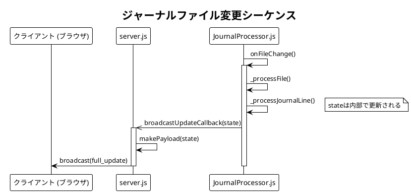
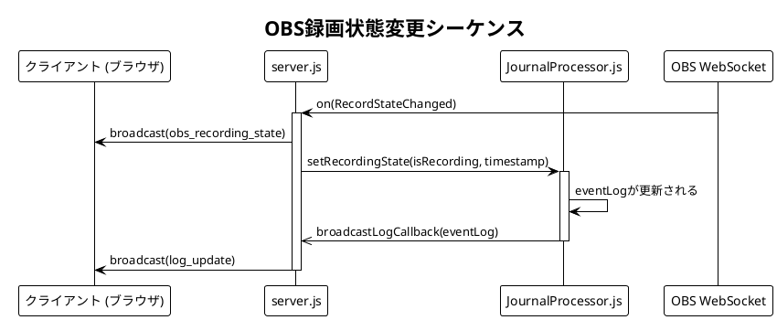

# ED Dashboard

設計資料本資料は、Elite: Dangerous リアルタイムダッシュボードのソフトウェアアーキテクチャ、主要なプロセス、およびAPI仕様の概要を記述する。

## 1. アーキテクチャ概要

本システムは、複数の独立したモジュールで構成されている。

- `server.js`: アプリケーションの中央コントローラーとなる。責務を以下に示す。
  - ExpressサーバーとWebSocketサーバーの起動。
  - 他のすべてのモジュールの初期化と連携。
  - クライアントとのWebSocket接続の管理。
  - OBS WebSocketサーバーとの通信のハンドリング。
  - JournalProcessor からの通知の受信と、整形済みデータのクライアントへのブロードキャスト。
- `src/journalProcessor.js`: アプリケーションのコアロジックモジュールとなる。クラスとして実装されており、ジャーナル処理に関連するすべてのロジックをカプセル化している。責務を以下に示す。
  - `chokidar` を用いたElite: Dangerousのジャーナルディレクトリのファイル変更監視。
  - ジャーナルエントリと Status.json をパースし、アプリケーションの状態を更新。
  - 内部的な状態フラグ（例：戦闘状態、着陸シーケンス）の管理。
  - 注入されたコールバック関数を介した、server.js への状態変更の通知。
- src/constants.js: アプリケーション全体で利用される定数をエクスポートするモジュールとなる。これには以下が含まれる。
  - PORT などのサーバー設定。
  - パイロットのランク定義（FED_RANKS, COMBAT_RANKS など）といった静的なゲームデータ。
- `public/`: クライアントサイドのすべての静的アセットを格納するディレクトリ。
  - `index.html`: UIの主要な構造。
  - `assets/style.css`: UIのスタイル。
  - `assets/script.js`: WebSocket通信と動的なDOM操作のためのクライアントサイドロジック。

## 2. 主要なシーケンス

システム内の主要な相互作用フローを示す。

### ジャーナルファイル変更シーケンス

ジャーナルファイルの変更がUIにリアルタイム更新される流れを以下のシーケンス図に示す。



### OBS録画状態変更シーケンス

OBSの録画イベントが処理されUIに反映される流れを以下のシーケンス図に示す。



## 3.状態遷移
`JournalProcessor`は以下の主要な状態を管理する。

- **飛行中 (`InFlight`)**:
    - `Hardpoints Deployed` イベントにより **戦闘中** 状態へ移行する。
    - `Landing Gear Down` イベントにより **着陸シーケンス** 状態へ移行する。
    - `DockingGranted` イベントにより **着陸シーケンス** 状態へ移行する。
- **着陸シーケンス(`LandingSequence`)**
    - `Landing Gear Up` イベントにより **飛行中** 状態へ移行する。
    - `DockingCancelled` イベントにより **飛行中** 状態へ移行する。
    - `Docked`または`Touchdown`イベントにより **着艦 / 着陸** 状態へ移行する。
- **着艦 / 着陸**
    - `Undocked`または`Liftoff`イベントにより **飛行中** 状態へ移行する。

## 4. WebSocket API仕様

本セクションでは、サーバーとクライアント間のWebSocket通信に関する仕様を定義する。

### 4.1. メッセージフォーマット
すべてのメッセージは、以下の構造を持つJSON文字列として送信される。

```
{
  "type": "message_type",
  "payload": { ... }
}
```
- type: (String) メッセージの種別。
- payload: (Object) メッセージに関連付けられたデータ。

## 4.2. サーバーからクライアントへのメッセージ

サーバーからクライアントへ送信されるメッセージ。

| 種別| 説明| ペイロード例 | 
|:--- |:---|:---|
| full_update | 最新の統計情報をすべて送信する。クライアントの初回接続時や状態リセット後に送信される。| `{ "bounty": { "count": 10, ... }, ... }` |
| log_update | 更新されたイベントログの配列を送信する。| `["[00:00:00] -- 録画開始 --"]`|
| obs_recording_state | OBSの録画ステータスの変更をクライアントに通知する。 | `{ "isRecording": true }`| 

### 4.3. クライアントからサーバーへのメッセージ

クライアントからサーバーへ送信されるメッセージ。

| 種別 | 説明 | ペイロード |
|:--- |:---|:---|
| reset_stats | サーバーにすべての統計データのリセットを要求する。 | `null` |
| start_obs_recording | サーバーにOBSの録画開始を要求する。 | `null` |
| stop_obs_recording | サーバーにOBSの録画停止を要求する。 | `null` |