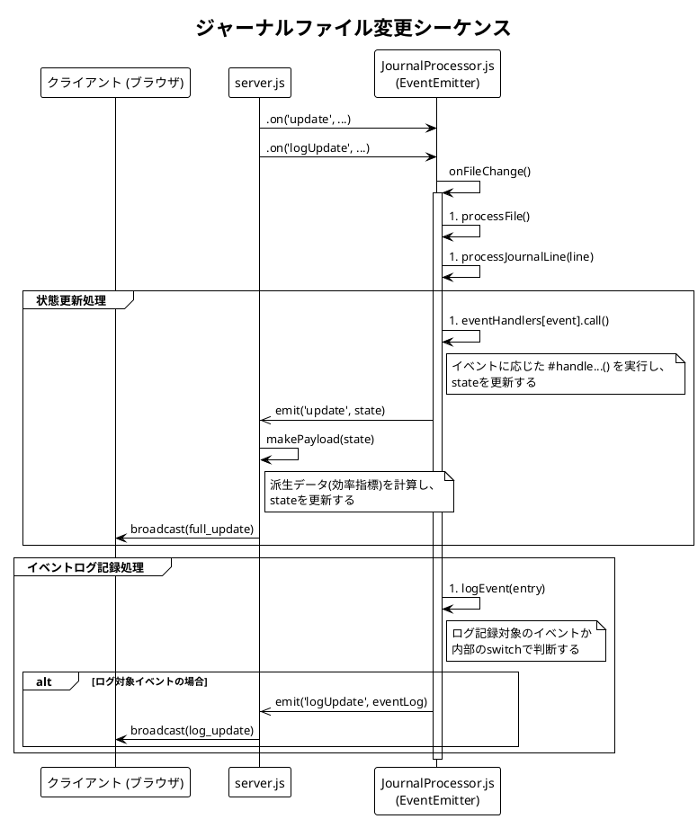
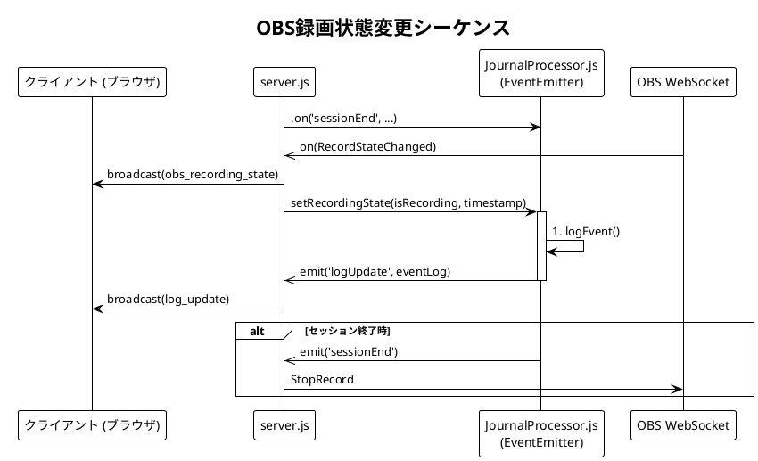
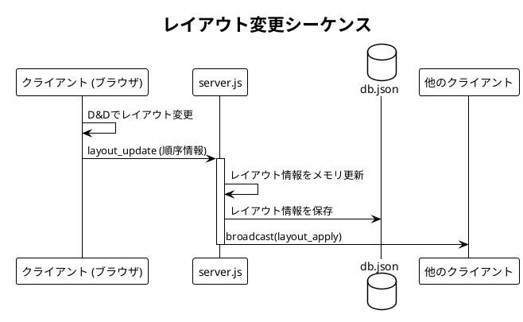

# ED Dashboard

本資料は、Elite: Dangerous リアルタイムダッシュボードのソフトウェアアーキテクチャ、主要なプロセス、およびAPI仕様の概要を記述する。

## 1. アーキテクチャ概要

本システムは、複数の独立したモジュールで構成されている。

- `server.js`: アプリケーションの中央コントローラーとなる。責務を以下に示す。
  - ExpressサーバーとWebSocketサーバーの起動。
  - 他のすべてのモジュールの初期化と連携。
  - クライアントとのWebSocket接続の管理。
  - OBS WebSocketサーバーとの通信のハンドリング。
  - `JournalProcessor`から発行されるイベント（`update`, `logUpdate`など）をリッスンし、整形済みデータをクライアントにブロードキャストする。
  - `lowdb` を使用したデータの永続化（読み書き）管理。
- `src/journalProcessor.js`: アプリケーションのコアロジックモジュールとなる。クラスとして実装されており、ジャーナル処理に関連するすべてのロジックをカプセル化している。責務を以下に示す。
  - `chokidar` を用いたElite: Dangerousのジャーナルディレクトリのファイル変更監視および `stopMonitoring()` によるクリーンアップ処理の提供。
  - ジャーナルエントリと Status.json をパースし、アプリケーションの状態を更新。
  - 進行中の旅客ミッション（救出ミッションを含む）をID単位で追跡し、乗船中人数や輸送完了数、救出中フラグを管理。
  - 内部的な状態フラグ（例：戦闘状態、着陸シーケンス）の管理。
  - `EventEmitter`を継承し、状態変更があった際に`update`や`logUpdate`といったイベントを発行（emit）して外部に通知する。
- `src/constants.js`: アプリケーション全体で利用される定数をエクスポートするモジュールとなる。これには以下が含まれる。
  - PORT などのサーバー設定。
  - パイロットのランク定義（FED_RANKS, COMBAT_RANKS など）といった静的なゲームデータ。
- `src/utils.js`: アプリケーション全体で利用されるヘルパー関数を提供するモジュール。責務を以下に示す。
  - ジャーナルファイルのパス解決。
  - 日付や数値のフォーマット処理。
- `db.json`: アプリケーションの設定（レイアウト）および過去のセッション統計を保持するローカルJSONデータベースファイル。
- `public/`: クライアントサイドのすべての静的アセットを格納するディレクトリ。
  - `index.html`: UIの主要な構造。
  - `assets/style.css`: UIのスタイルシート。
  - `assets/main.js`: クライアントサイドのメインスクリプト。アプリケーションの初期化を行う。
  - `assets/uiUpdater.js`: UIの更新ロジックをカプセル化したモジュール。
  - `assets/websocketClient.js`: WebSocket通信を管理するモジュール。
  - `assets/charts.js`: 埋め込みグラフ（Sparkline、燃料残量）を管理するモジュール。
- `bin/simulator.js`: 開発用のジャーナルシミュレータスクリプト。
- `tests/`: 自動テストコードを格納するディレクトリ（単体テスト、結合テスト、およびテスト用フィクスチャ）。

## 2. 主要なシーケンス

システム内の主要な相互作用フローを示す。

### ジャーナルファイル変更シーケンス

ジャーナルファイルの変更がUIにリアルタイム更新される流れを以下のシーケンス図に示す。
#processJournalLine は、イベントの種類に応じて #eventHandlers マップから適切な状態更新メソッドを呼び出す。同時に、ロギングメソッド #logEvent を呼び出し、イベントログに記録すべきかどうかの判断を委譲するディスパッチャとして機能する。

```plantuml
@startuml
!theme plain
title ジャーナルファイル変更シーケンス

participant "クライアント (ブラウザ)" as Client
participant "server.js" as Server
participant "JournalProcessor.js\n(EventEmitter)" as Processor

Server -> Processor: .on('update', ...)
Server -> Processor: .on('logUpdate', ...)

Processor -> Processor: onFileChange()
activate Processor
Processor -> Processor: #processFile()
Processor -> Processor: #processJournalLine(line)

group 状態更新処理
    Processor -> Processor: #eventHandlers[event].call()
    note right of Processor: イベントに応じた #handle...() を実行し、\nstateを更新する
    Processor ->> Server: emit('update', state)
    Server -> Server: makePayload(state)
    note right of Server: 派生データ(効率指標)を計算し、\nstateを更新する
    Server -> Client: broadcast(full_update)
end

group イベントログ記録処理
    Processor -> Processor: #logEvent(entry)
    note right of Processor: ログ記録対象のイベントか\n内部のswitchで判断する
    alt ログ対象イベントの場合
        Processor ->> Server: emit('logUpdate', eventLog)
        Server -> Client: broadcast(log_update)
    end
end

deactivate Processor
@enduml
```

### OBS録画状態変更シーケンス

OBSの録画イベントが処理されUIに反映される流れを以下のシーケンス図に示す。


```plantuml
@startuml
!theme plain
title OBS録画状態変更シーケンス

participant "クライアント (ブラウザ)" as Client
participant "server.js" as Server
participant "JournalProcessor.js\n(EventEmitter)" as Processor
participant "OBS WebSocket" as OBS

Server -> Processor: .on('sessionEnd', ...)

OBS ->> Server: on(RecordStateChanged)
Server -> Client: broadcast(obs_recording_state)
Server -> Processor: setRecordingState(isRecording, timestamp)
activate Processor
Processor -> Processor: #logEvent()
Processor ->> Server: emit('logUpdate', eventLog)

deactivate Processor
Server -> Client: broadcast(log_update)

alt セッション終了時
Processor ->> Server: emit('sessionEnd')
Server -> OBS: StopRecord

end
@enduml
```

### レイアウト変更シーケンス

あるクライアントでカードの並び順変更が行われた場合のシーケンス図を示す。


```plantuml
@startuml
!theme plain
title レイアウト変更シーケンス

participant "クライアント (ブラウザ)" as Client
participant "server.js" as Server
database "db.json" as DB
participant "他のクライアント" as OtherClient

Client -> Client: D&Dでレイアウト変更
Client -> Server: layout_update (順序情報)
activate Server
Server -> Server: レイアウト情報をメモリ更新
Server -> DB: レイアウト情報を保存
Server -> OtherClient: broadcast(layout_apply)
deactivate Server
@enduml
```

## 3. 状態遷移

`JournalProcessor`は、ジャーナルファイルに記録される**イベント**と、`Status.json`に記録されるリアルタイムな**状態**の2つの情報源を基に、プレイヤーの状態を管理する。

ジャーナルが「撃破」「ジャンプ完了」といった完了済みのイベントを記録するのに対し、`Status.json`は「ハードポイント展開中」「ランディングギア下降中」といった**継続的な状態**をリアルタイムに反映する。これにより、ジャーナルだけでは検知できない文脈（例: 戦闘の開始）を捉えることが可能となる。

主要な状態と、その遷移トリガーを以下に示す。

- **飛行中 (`InFlight`)**:
  - `Status.json`のフラグ変更 (`Hardpoints Deployed`) により **戦闘中** 状態へ移行する。
  - `Status.json`のフラグ変更 (`Landing Gear Down`) により **着陸シーケンス** 状態へ移行する。
  - `DockingGranted` (ジャーナルイベント) により **着陸シーケンス** 状態へ移行する。
- **戦闘中 (`Combat`)**:
  - `Status.json`のフラグ変更 (`Hardpoints Retracted`) により **飛行中** 状態へ移行する。
- **着陸シーケンス (`LandingSequence`)**:
  - `Status.json`のフラグ変更 (`Landing Gear Up`) により **飛行中** 状態へ移行する。
  - `DockingCancelled` (ジャーナルイベント) により **飛行中** 状態へ移行する。
  - `Docked`または`Touchdown` (ジャーナルイベント) により **着艦 / 着陸** 状態へ移行する。
- **着艦 / 着陸 (`Landed`)**:
  - `Undocked`または`Liftoff` (ジャーナルイベント) により **飛行中** 状態へ移行する。

## 4. WebSocket API仕様

本セクションでは、サーバーとクライアント間のWebSocket通信に関する仕様を定義する。

### 4.1. メッセージフォーマット
すべてのメッセージは、以下の構造を持つJSON文字列として送信される。

```
{
  "type": "message_type",
  "payload": { ... }
}
```
- type: (String) メッセージの種別。
- payload: (Object) メッセージに関連付けられたデータ。

## 4.2. サーバーからクライアントへのメッセージ

サーバーからクライアントへ送信されるメッセージ。

| 種別| 説明| ペイロード例 | 
|:--- |:---|:---|
| full_update | 最新の統計情報をすべて送信する。クライアントの初回接続時や状態リセット後に送信される。| `{ "bounty": { "count": 10, ... }, ... }` |
| log_update | 更新されたイベントログの配列を送信する。| `["[00:00:00] -- 録画開始 --"]`|
| obs_recording_state | OBSの録画ステータスの変更をクライアントに通知する。 | `{ "isRecording": true }`| 
| history_update | 過去のセッション履歴を送信する。 | `[{ "date": "2023-10-27", "profit": 100000, ... }]` |
| layout_apply | レイアウトの更新を通知する。 | `{'columns': {'left-column': ['rank-progression', ...], 'right-column': ['combat', ...]}, 'collapsed': {'toggle-progress': true}}` |

### 4.3. クライアントからサーバーへのメッセージ

クライアントからサーバーへ送信されるメッセージ。

| 種別 | 説明 | ペイロード |
|:--- |:---|:---|
| reset_stats | サーバーにすべての統計データのリセットを要求する。 | `null` |
| resume_last_session | サーバーに最後のセッションの再開を要求する。 | `null` |
| get_history | サーバーに過去のセッション履歴の取得を要求する。 | `null` |
| start_obs_recording | サーバーにOBSの録画開始を要求する。 | `null` |
| stop_obs_recording | サーバーにOBSの録画停止を要求する。 | `null` |
| layout_update | レイアウトの変更をサーバに通知する。 | `{'columns': {'left-column': ['rank-progression', ...], 'right-column': ['combat', ...]}, 'collapsed': {'toggle-progress': true}}` |

## 5. 永続化と可視化 (Persistence & Visualization)

本セクションでは、ユーザー体験を向上させるためのデータ永続化と可視化機能の設計について記述する。

### 5.1. データ永続化 (Persistence)

`lowdb` ライブラリを使用し、軽量なJSONデータベース `db.json` を用いて以下のデータを管理する。

#### 保存対象データ

1.  **レイアウト設定 (`layout`)**:
      * ユーザーがカスタマイズしたカードの並び順（`cardOrder`）。
      * `layout_update` イベント受信時に保存し、サーバー起動時およびクライアント接続時に読み込む。
2.  **セッション履歴 (`history`)**:
      * 過去のセッション統計（日付、総利益、撃墜数、探索スキャン数など）。
      * アプリケーション終了時（`SIGINT`等）や日付変更時に、現在のセッション統計をコミットする。
      * 次回起動時に「前回セッションとの比較（例: 前日比）」を表示するために使用する。

#### セッション復元 (Session Resume) の仕様

- **再開可能性判定 (`isResumable`)**:
  サーバー起動直後、ゲームプレイの開始とみなされるイベント（ジャンプ、戦闘報酬、取引、ミッション受注など）が発生する前であれば、前回のセッションから状態を復元できる。
  - ゲームプレイ開始とみなさない除外イベント: `LoadGame`, `Music`, `Progress`, `Rank`, `Promotion`
  - 上記以外のゲームプレイ関連イベントを1つでも受信した場合、`isResumable` は `false` になり、再開不可能となる。
- **復元処理の挙動**:
  クライアントから `resume_last_session` 要求を受信した際、`isResumable` が `true` であれば `db.json` の履歴（`history` 配列の最終要素）を読み出す。
  `JournalProcessor` は、初期状態（`getInitialState()` のコピー）にその履歴データをマージして現在の状態を上書きし、セッション再開時の経過時間や燃料計測用タイマーを再始動する。復元完了後、同一セッションでの多重復元を防ぐため `isResumable` を `false` に設定する。

### 5.2. データ可視化 (Visualization)

UIの視認性を損なわず、数値の傾向を把握可能にするため、**スパークライン（Sparkline）** を導入する。

#### 実装方針

  * **ライブラリ**: `Chart.js` を使用する。
  * **デザイン**:
      * 軸（Scales）、凡例（Legend）、グリッド線をすべて非表示にする。
      * 線（Line）または棒（Bar）のみをミニマルに描画する。
      * 配色は現在のテーマカラー（オレンジ）をベースとし、透明度を下げて数値情報を阻害しないようにする。

#### 適用箇所

  * **Combat Summary**: 賞金獲得額の推移（直近10件の履歴データ `state.bounty.bountyHistory`）。
  * **Trading Summary**: 取引ごとの利益の推移（直近10件の履歴データ `state.trading.tradingProfitHistory`）。
  * **Fuel Summary**: 燃料残量の推移（過去60分間の履歴データ `state.fuel.history`）。1分毎の定期タイマーでサンプリングし、最大値 `state.fuel.max` を上限値とした時間系列グラフを描画する。

## 6. 開発ユーティリティとテスト (Development & Testing)

### 6.1. ジャーナルシミュレータ (`bin/simulator.js`)

ゲーム実機を起動することなく、ローカル開発環境でダッシュボードの表示動作やレイアウト変更、WebSocket通信を確認するためのシミュレーションツール。
- **入力ソース**: `tests/fixtures/journal-test.log` に保存されたテスト用のジャーナル行データ。
- **処理の流れ**:
  1. テストデータを1行ずつ読み込む。
  2. タイムスタンプ（`timestamp` プロパティ）を、書き込むタイミングの現在時刻に書き換える。
  3. 設定された `JOURNAL_DIR` の配下に、`Journal.YYYY-MM-DD.sim.log`（シミュレーション用ファイル）として追記保存する。
  4. 追記はデフォルトで1秒（1000ms）間隔でループ処理され、すべての行を書き終えると正常終了する。

### 6.2. 自動テスト構成

本システムは、品質維持とデグレード防止のため、Vitest を用いた自動テストを実行可能な構造になっている。

- **単体テスト (Unit Tests)**:
  - `tests/unit/journalProcessor.test.js`: ジャーナルイベント監視のモックを作成し、各種ジャーナル（戦闘、交易、探索、マテリアル、進行状況）のパース結果が正しく状態 `state` に集約されるか検証。旅客ミッションの搭乗・輸送状況や、難民救出ミッションによる救出フラグ (`isRescueMissionActive`) の切り替えもカバー。
  - `tests/unit/utils.test.js`: 経過時間フォーマット、初期状態生成ロジックの動作検証。
- **結合テスト (Integration Tests)**:
  - `tests/integration/server.test.js`: `supertest` および WebSocket クライアントを用いた結合テスト。WebSocket サーバーの起動、接続時の初期状態/履歴データの送信、クライアントからのリセット (`reset_stats`)・レイアウト変更 (`layout_update`)・セッション再開 (`resume_last_session`) の処理、および `db.json` への読み書き動作を検証。
